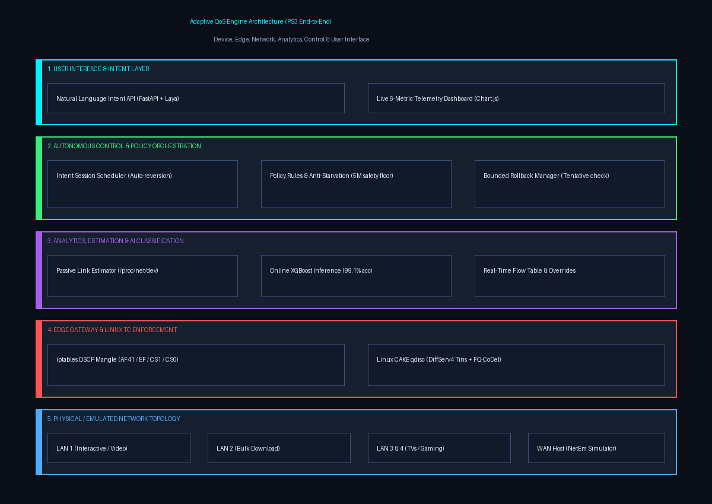

# Adaptive QoS Engine: End-to-End Architecture Specification



This document provides the formal architectural specification for the Adaptive QoS Engine, fulfilling the `ps3.md` requirement that:
> *"The solution should be decomposed into independently testable modules. Teams should define inputs, outputs, state transitions, failure handling and success conditions for each module."*

---

## 1. High-Level System Architecture

The architecture is structured across six coordinated layers:

```
[ Layer 1: User Interface & Intent ]
   FastAPI REST API (/intent, /override, /status) ─── Telemetry Dashboard (Chart.js 6-metric)
                        │                                          ▲
                        ▼                                          │
[ Layer 2: Autonomous Control ]                                    │
   controller_daemon.py ── IntentScheduler ── decide_policy() ──────┘
                        │
                        ▼
[ Layer 3: Safety & Remediation ]
   RollbackManager (Tentative -> QoE Health Check -> Commit or Rollback)
                        │
                        ▼
[ Layer 4: Kernel Enforcement ]
   iptables/ip6tables DSCP Mangle Engine ─── Linux CAKE qdisc (DiffServ4 Tins)
                        ▲
                        │ (Packets marked per flow classification)
[ Layer 5: Analytics & AI ]
   Passive Estimator ── LiveFlowSniffer (IPv4/v6) ── XGBoost Inference (xgb_model.pkl)
                        ▲
                        │
[ Layer 6: Physical / Emulated Network Topology ]
   LAN Hosts (lan1, lan2, lan3, lan4) ─── Gateway (gw) ─── WAN Host (wanhost NetEm)
```

---

## 2. Module Specifications (Inputs, Outputs, State Transitions, Failure Handling & Success Conditions)

### Module 1: Real-Time Flow Classifier (`classifier/`)
* **Purpose:** Inspects packet headers without decrypting payloads, extracts rolling NetMatrix features, and classifies flows using a trained XGBoost model.
* **Inputs:**
  - Raw network packet headers from `veth-lan1-gw` and `veth-lan2-gw` (IPv4 `IP` or IPv6 `IPv6`).
  - Feature tuple: `total_length` (bytes), `ttl`/`hop_limit`, `inter_arrival_ms` (milliseconds).
* **Outputs:**
  - Flow classification dictionary: `{'class': str, 'confidence': float, 'probabilities': dict, 'needs_confirmation': bool}`.
  - Active flow entries in thread-safe `FlowTable`.
* **State Transitions:**
  $$\text{Unobserved} \xrightarrow{\ge 1\text{ pkt}} \text{Tracking} \xrightarrow{\ge 3\text{ pkts}} \text{Classified} \xrightarrow{\text{Override}} \text{Overridden} \xrightarrow{> 30\text{s idle}} \text{Evicted}$$
* **Failure Handling:**
  - Malformed packet / unknown protocol: Ignored safely; packet continues unhindered.
  - Low confidence ($< 0.70$): Flags `needs_confirmation: True`, routes to Best Effort default.
* **Success Conditions:**
  - Classification latency $< 2$ ms per sample.
  - Offline classification accuracy $\ge 99\%$ on test set (improving $+5.5\%$ over heuristic baseline).

---

### Module 2: Link Capacity Estimator (`estimator/`)
* **Purpose:** Determines available end-to-end WAN capacity and available bandwidth dynamic range using active Self-Loading Periodic Streams (SLoPS) probing per Jain & Dovrolis (2002/2003, 2004). Prevents bufferbloat by determining true link bottleneck without relying on saturating TCP cross-traffic or flawed passive counter heuristics. Detailed in [m2_link_estimator.md](m2_link_estimator.md).
* **Inputs:**
  - Microsecond-paced periodic UDP probe streams at rate $R$ (K packets of size P).
  - One-way delay timestamps recorded at receiver socket (`wanhost`).
  - Hysteresis configuration (default: 15% delta threshold) and convergence tolerance (3 Mbps).
* **Outputs:**
  - `CapacityEstimate`: `estimated_bandwidth_min_mbps`, `estimated_bandwidth_max_mbps`, `estimated_bandwidth_mid_mbps`, `effective_capacity_mbps`.
  - Confidence metric $[0.0, 1.0]$, PCT, PDT, convergence flag, stability flag.
* **State Transitions:**
  $$\text{IDLE} \to \text{PROBING} \to \text{MEASURING} \to \text{TREND\_ANALYSIS} \to \text{BOUND\_UPDATE} \to \text{CONVERGING} \to \text{STABLE} \ (\text{or } \text{DEGRADED})$$
* **Failure Handling:**
  - Receiver unreachable / socket timeout: Safe fallback to last-known-good capacity with state `DEGRADED`.
  - Transient delay noise: Median filtering across $G=10$ groups; dual Pairwise Comparison Test (PCT $> 0.55$) and Pairwise Difference Test (PDT $> 0.40$).
* **Success Conditions:**
  - Available bandwidth range $[R_{\min}, R_{\max}]$ resolved in $\le 8$ iterations ($< 0.5$s total probing duration).
  - Static estimation error $\le 20\%$ against controlled Linux `netem` bottleneck ground truth.
  - Hysteresis protection suppresses policy oscillations when capacity variations are $< 15\%$.

---

### Module 3: Policy Engine & Intent Scheduler (`policy_engine/`)
* **Purpose:** Translates network metrics, active flow classes, and user requests into an optimal CAKE shaping rate and DSCP tier assignments.
* **Inputs:**
  - `available_bandwidth_mbps` (from Estimator).
  - `active_flows` (from Flow Table).
  - `user_intent` (from FastAPI `/intent`).
* **Outputs:**
  - Policy Decision Dictionary: `{'bandwidth_mbit': int, 'diffserv_mode': 'diffserv4', 'min_bulk_bandwidth_mbit': int, 'starvation_floor_active': bool}`.
* **State Transitions:**
  $$\text{Default Policy} \xrightarrow{\text{Intent / Rate Change}} \text{Active Priority} \xrightarrow{\text{Timer Expiry}} \text{Revert to Baseline}$$
* **Failure Handling:**
  - Nil or negative bandwidth: Applies safe default floor of 10 Mbps.
  - Starvation threat: Enforces absolute 5 Mbps safety floor and 20% minimum bulk allocation.
* **Success Conditions:**
  - Policy calculated deterministically in $< 1$ ms.
  - Temporary priority reverts automatically upon timer expiration.

---

### Module 4: Rollback Manager & QoE Health Check (`policy_engine/rollback_manager.py`)
* **Purpose:** Guarantees observable, bounded, and reversible configuration changes (Constraint C10).
* **Inputs:**
  - Target bandwidth and diffserv parameters.
  - Latency threshold ($\le 60$ ms) and maximum packet loss rate ($\le 5\%$).
* **Outputs:**
  - Execution status: `applied_successfully`, `health_check_passed`, `rolled_back`.
  - Checkpointed state snapshots in `history_log`.
* **State Transitions:**
  $$\text{Known-Good State} \xrightarrow{\text{Apply}} \text{Tentative Checkpoint} \xrightarrow{\text{Pass Health Check}} \text{Permanent Commit}$$
  $$\text{Tentative Checkpoint} \xrightarrow{\text{Fail Health Check}} \text{Revert to Last Known-Good}$$
* **Failure Handling:**
  - Ping / health probe timeout: Presumes link collapse; immediately triggers `rollback()`.
  - Non-zero tc returncode: Retains previous configuration without mutating state.
* **Success Conditions:**
  - Zero permanent disruption; unviable policies reverted in $< 3$ seconds.

---

### Module 5: Kernel Enforcement & Packet Marking (`enforcement/`)
* **Purpose:** Applies Linux Traffic Control (`tc`) CAKE qdiscs and Netfilter DSCP mangle rules to enforce true priority queueing at the kernel level.
* **Inputs:**
  - Flow 5-tuples and target classes.
  - DSCP Codepoints: Video (`AF41`), Voice/Gaming (`EF`), Bulk (`CS1`), Best Effort (`CS0`).
* **Outputs:**
  - Netfilter PREROUTING mangle rules in `gw` namespace.
  - CAKE root qdisc with DiffServ4 active tins on `veth-gw-wan`.
* **Failure Handling:**
  - Duplicate rules: Auto-cleans existing host rules before inserting.
  - Missing kernel modules: Documented with custom kernel build guide (`docs/kernel_build.md`).
* **Success Conditions:**
  - Verified packet increments across CAKE Tin 0 (Bulk) and Tin 2 (Video) via `tc -s qdisc`.

---

### Module 6: Telemetry Dashboard & Intent API (`dashboard/`, `api/`)
* **Purpose:** Ingests user intents and provides live 6-metric telemetry visualization.
* **Inputs:**
  - REST requests (`POST /intent`, `POST /override`, `GET /status`).
  - Polled telemetry from `metrics_collector.py`.
* **Outputs:**
  - JSON API responses.
  - Responsive web dashboard displaying Latency, Jitter, Loss, Throughput, Queue Depth, and Fairness.
* **Success Conditions:**
  - Dashboard auto-refreshes every 2 seconds with sub-second chart rendering.
